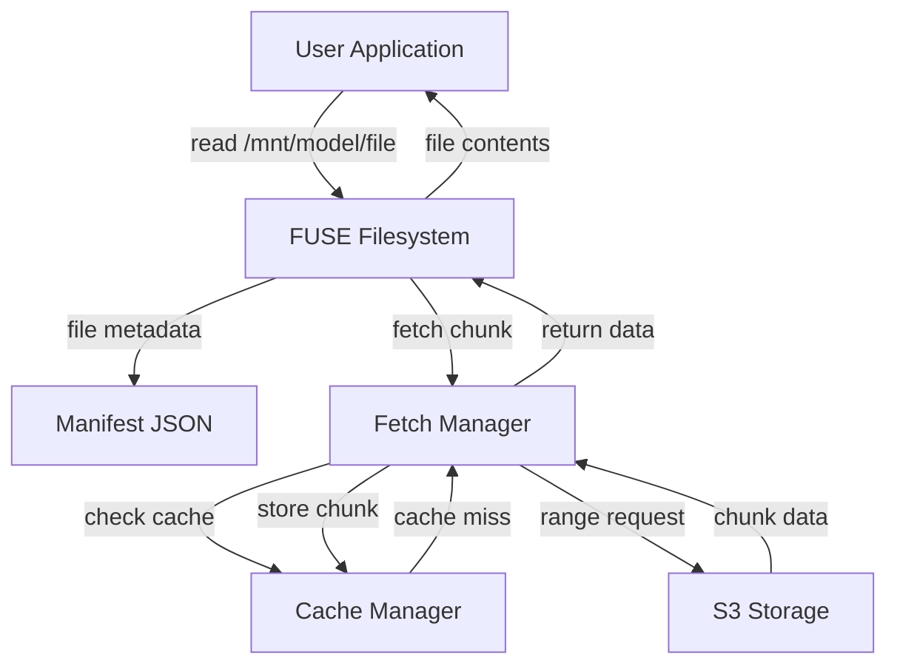
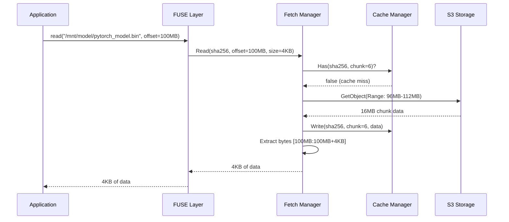

# MLArtifactFS

A FUSE-based filesystem for lazy-loading ML models from S3 storage. Designed for rapid experimentation and A/B testing of ML models in containerized environments.

## Overview

MLArtifactFS enables you to decouple ML model artifacts from Docker images, allowing instant model version switching without image rebuilds. Perfect for rapid experimentation workflows.

**Status:** Proof-of-Concept (In Development)

## Features (Planned)

- **Lazy Loading**: Download model files on-demand from S3
- **Smart Prefetching**: Load critical files (config, tokenizer) at mount time
- **Fast Version Switching**: Change models by swapping manifest files
- **Content-Addressable**: SHA256-based caching and verification
- **Container-Ready**: Works in Docker with FUSE support

## Quick Start

### Installation

```bash
go install github.com/jakeBringetto/mlartifactfs/cmd/mlfs@latest
```

Or build from source:

```bash
git clone https://github.com/jakeBringetto/mlartifactfs.git
cd mlartifactfs
go build -o mlfs ./cmd/mlfs
```

### Usage

#### 1. Prepare Your Model

Download from HuggingFace and upload to S3:

```bash
# Download model
huggingface-cli download distilbert-base-uncased --local-dir ./distilbert

# Upload to S3
aws s3 sync ./distilbert s3://my-models/distilbert/v1/ --acl public-read
```

#### 2. Generate Manifest

```bash
mlfs generate \
  --id distilbert \
  --version v1 \
  --url-prefix https://my-models.s3.amazonaws.com/distilbert/v1 \
  --prefetch config.json,tokenizer.json \
  ./distilbert > manifest.json
```

#### 3. Mount the Filesystem

```bash
mlfs mount --manifest manifest.json /mnt/model
```

#### 4. Use Your Model

```bash
ls /mnt/model/
python run_inference.py --model-path /mnt/model
```

## Docker Usage

```bash
docker run --rm \
  --cap-add SYS_ADMIN \
  --device /dev/fuse \
  -v $(pwd)/manifest.json:/manifest.json \
  -e AWS_ACCESS_KEY_ID \
  -e AWS_SECRET_ACCESS_KEY \
  my-ml-image \
  mlfs mount --manifest /manifest.json /mnt/model
```

## Architecture

- **Manifest Format**: JSON file defining virtual filesystem structure and S3 URLs
- **FUSE Filesystem**: Read-only virtual filesystem using hanwen/go-fuse
- **Fetch Manager**: Lazy fetches 16 MB chunks from S3 with caching
- **Cache Manager**: Local disk cache with SHA256 verification

### Architecture Diagram



### Component Flow




## Requirements

- Go 1.23+
- Linux with FUSE support
- Docker with `--cap-add SYS_ADMIN --device /dev/fuse` for containerized usage
- S3 bucket or S3-compatible storage

## Development

```bash
# Run tests
go test ./pkg/...

# Build
go build -o mlfs ./cmd/mlfs

# Run with Docker
docker build -t mlartifactfs .
```

## Use Case

MLArtifactFS is designed for **rapid ML experimentation**, not production deployment. Use it to:

- A/B test multiple model versions quickly
- Iterate on model variants without rebuilding images
- Prototype model serving architectures

## Acknowledgments
- Inspired by SOCI, Stargz, and CRFS lazy loading concepts
