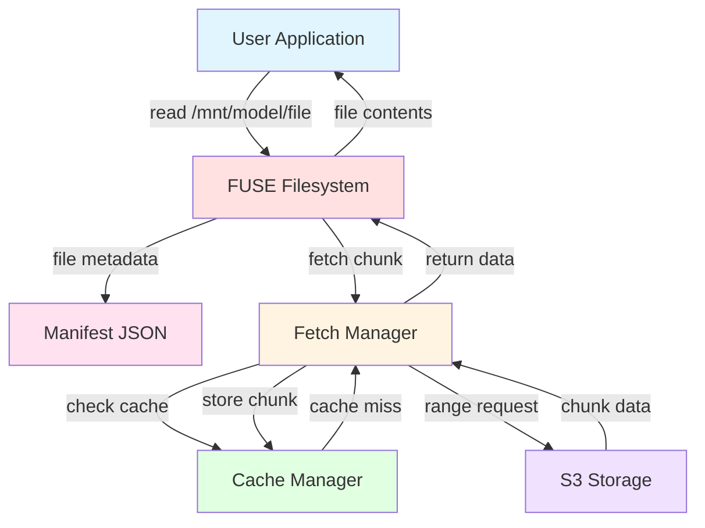
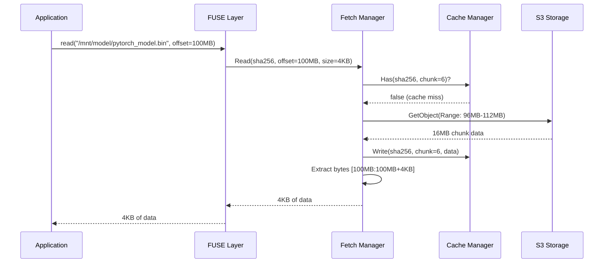

# Step 3 — Design

## System Overview

MLArtifactFS is a read-only FUSE filesystem that presents remote S3-stored ML model files as a local directory tree. Files are lazily fetched on first access and cached locally. A manifest file defines the virtual filesystem structure and metadata.

**Design Philosophy:**
- Lazy by default, eager when hinted (prefetch)
- Content-addressable (SHA256 verification)
- Fail-fast on errors (no silent corruption)
- Single-binary deployment

### Architecture Diagram



### Component Flow



---

## System Boundary

**Inputs:**
- Manifest JSON file (defines virtual filesystem)
- S3 bucket/prefix (where model files are stored)
- Mount point (local directory where FS will be mounted)

**Outputs:**
- Virtual filesystem at mount point (read-only)
- Cached files (local disk or tmpfs)
- Logs (stdout/stderr)

**External Dependencies:**
- S3 API (GetObject with Range header)
- Linux FUSE kernel module (/dev/fuse)
- Docker capabilities (SYS_ADMIN)

---

## Major Components

### 1. **CLI Entry Point** (`cmd/mlfs/main.go`)

Two primary subcommands:

#### `mlfs generate`
Walks a local model directory and generates a manifest.

**Flags:**
- `--id` (artifact ID, e.g., "llama-7b")
- `--version` (version string, e.g., "v1.1")
- `--url-prefix` (S3 base URL, e.g., "https://s3.amazonaws.com/bucket/llama/v1.1")
- `--prefetch` (comma-separated paths to prefetch, e.g., "config.json,tokenizer.json")
- Input: local directory path
- Output: manifest JSON to stdout

**Process:**
1. Recursively walk directory
2. For each file: compute SHA256, get size, construct S3 URL
3. Emit manifest JSON

#### `mlfs mount`
Mounts the virtual filesystem using FUSE.

**Flags:**
- `--manifest` (path to manifest.json)
- `--cache-dir` (local cache directory, default: `/tmp/mlfs-cache`)
- `--log-level` (debug|info|warn|error)
- Mount point (positional arg)

**Process:**
1. Parse manifest
2. Initialize S3 client
3. Initialize cache manager
4. Prefetch files marked in manifest
5. Mount FUSE filesystem
6. Block until unmount

---

### 2. **Manifest Format** (`pkg/manifest/manifest.go`)

JSON schema defining the virtual filesystem:

```json
{
  "artifact_id": "llama-7b",
  "version": "v1.1",
  "mount_path": "/mnt/mlmodel",
  "prefetch": ["config.json", "tokenizer.json"],
  "files": [
    {
      "path": "config.json",
      "url": "https://s3.amazonaws.com/bucket/llama/v1.1/config.json",
      "size": 1234,
      "sha256": "abc123...",
      "compression": "none"
    },
    {
      "path": "pytorch_model.bin",
      "url": "https://s3.amazonaws.com/bucket/llama/v1.1/pytorch_model.bin",
      "size": 26843545600,
      "sha256": "def456...",
      "compression": "none"
    }
  ]
}
```

**Fields:**
- `artifact_id`: Human-readable model identifier
- `version`: Version string (content-addressable via manifest hash)
- `mount_path`: Suggested mount point (informational, not enforced)
- `prefetch`: List of file paths to download at mount time
- `files[]`: Array of file metadata
  - `path`: Relative path within mounted filesystem
  - `url`: Full S3 URL (supports presigned URLs)
  - `size`: File size in bytes
  - `sha256`: SHA256 hash for integrity verification
  - `compression`: "none" for MVP (future: "gzip", "zstd")

---

### 3. **FUSE Filesystem** (`pkg/fuse/fs.go`)

Implements `hanwen/go-fuse` nodefs interfaces.

**Core responsibilities:**
- Map FUSE operations (Lookup, Open, Read, Getattr) to manifest entries
- Delegate reads to Fetch Manager
- Return file attributes (size, mode, mtime) from manifest

**FUSE Operations:**

| Operation | Behavior |
|-----------|----------|
| `Lookup(name)` | Find file/dir in manifest, return inode |
| `Getattr(inode)` | Return size/mode from manifest (no S3 call) |
| `Open(inode)` | Return file handle, trigger prefetch if not cached |
| `Read(offset, size)` | Fetch chunk from cache or S3, return bytes |
| `Readdir(inode)` | List directory contents from manifest tree |

**Directory tree:**
- Built in-memory from manifest `files[].path` entries
- Uses trie or map structure for O(1) lookups

**Read-only enforcement:**
- Return `EROFS` (Read-Only File System) for write operations

---

### 4. **Fetch Manager** (`pkg/fetch/manager.go`)

Handles S3 range requests and caching.

**Responsibilities:**
- Download file chunks from S3 (8-16 MB ranges)
- Cache downloaded chunks to local disk
- Verify SHA256 on full file download
- Coordinate prefetch operations

**Read Strategy:**

```
FUSE Read(file, offset, size) →
  1. Check cache for byte range [offset, offset+size)
  2. If cached: return from disk
  3. If not cached:
     a. Calculate aligned 16 MB chunk containing range
     b. Issue S3 GetObject with Range header
     c. Write chunk to cache
     d. Return requested bytes
```

**Chunk Alignment:**
- Chunk size: 16 MB (based on S3 best practices)
- Alignment: Round offset down to 16 MB boundary
- Cache key: `<sha256>/<chunk_index>`

**Prefetch:**
- Executed at mount time for files in `manifest.prefetch[]`
- Downloads entire file sequentially
- Blocks mount operation until complete
- Verifies SHA256 after download

**Cache Structure:**
```
<cache-dir>/
  <sha256>/
    chunk_0    # bytes 0-16MB
    chunk_1    # bytes 16-32MB
    ...
    _verified  # marker file (SHA256 verified)
```

---

### 5. **S3 Client** (`pkg/s3/client.go`)

Thin wrapper around AWS SDK for Go v2.

**Operations:**
- `GetObjectRange(url, start, end) -> ([]byte, error)`
  - Issues GET request with `Range: bytes=start-end`
  - Returns chunk bytes
  - Handles 416 Range Not Satisfiable (read past EOF)

**Authentication:**
- Default AWS credential chain (env vars, IAM role, ~/.aws/credentials)
- Support for presigned URLs (no auth needed)

**Error Handling:**
- Retry transient errors (503, connection reset) with exponential backoff
- Fail fast on 403/404 (missing permissions/object)

---

### 6. **Cache Manager** (`pkg/cache/manager.go`)

Manages local cache directory.

**Responsibilities:**
- Initialize cache directory (create if missing)
- Check if chunk exists
- Read/write chunks
- Mark files as verified (after SHA256 check)

**Cache Eviction:**
- NOT IMPLEMENTED in MVP (cache grows unbounded)
- Future: LRU eviction, size limits

---

## Data Flow

### Scenario 1: Mount Filesystem

```
User: mlfs mount --manifest manifest.json /mnt/model
  ↓
1. Parse manifest.json
2. Initialize S3 client (test connectivity)
3. Initialize cache manager
4. Prefetch files in manifest.prefetch[]:
   - Download config.json (full file)
   - Download tokenizer.json (full file)
   - Verify SHA256 for each
5. Mount FUSE at /mnt/model
6. Block (FUSE server loop running)
```

### Scenario 2: Read File (Cold Cache)

```
App: open("/mnt/model/pytorch_model.bin")
  ↓
FUSE Open() → return handle
  ↓
App: read(handle, offset=100MB, size=4KB)
  ↓
FUSE Read() → FetchManager.Read()
  ↓
1. Check cache for chunk covering offset 100MB
2. Cache miss → issue S3 GetObject:
   Range: bytes=96MB-112MB (aligned 16MB chunk)
3. Write chunk to cache/<sha256>/chunk_6
4. Return bytes [100MB:100MB+4KB] to FUSE
5. FUSE returns to app
```

### Scenario 3: Read File (Warm Cache)

```
App: read(handle, offset=100MB+4KB, size=4KB)
  ↓
FUSE Read() → FetchManager.Read()
  ↓
1. Check cache for chunk covering offset 100MB+4KB
2. Cache hit → read from cache/<sha256>/chunk_6
3. Return bytes to FUSE
4. FUSE returns to app
```

### Scenario 4: Generate Manifest

```
User: mlfs generate --id llama --version v1.1 \
      --url-prefix https://s3.../llama/v1.1 \
      --prefetch config.json,tokenizer.json \
      ./llama-7b > manifest.json
  ↓
1. Walk ./llama-7b recursively
2. For each file:
   - path = relative path
   - size = stat(file).Size
   - sha256 = hash file contents
   - url = url-prefix + "/" + path
3. Emit JSON to stdout
```

---

## Key Design Decisions

### Decision 1: Chunk Size (16 MB)
**Rationale:** AWS recommends 8-16 MB ranges for optimal throughput. Larger chunks reduce request overhead; smaller chunks reduce wasted bandwidth.

**Trade-off:** 16 MB chunks mean reading 1 byte fetches 16 MB (overread). Acceptable for ML models with sequential access patterns.

### Decision 2: Prefetch at Mount Time
**Rationale:** Small critical files (config, tokenizer) are always accessed first. Blocking mount until prefetch completes eliminates startup latency.

**Trade-off:** Mount operation can take 1-10 seconds depending on prefetch size. Acceptable for ML inference startup.

### Decision 3: SHA256 Verification After Full Download
**Rationale:** Verifying every chunk adds overhead. Verify once after full file is cached.

**Trade-off:** Partial reads don't verify integrity. Acceptable for POC; content-addressable URLs mitigate risk.

### Decision 4: Unbounded Cache
**Rationale:** MVP scope. Assume cache fits in container disk or volume.

**Trade-off:** Cache grows indefinitely. Document requirement to provision sufficient disk.

### Decision 5: Single Mount per Process
**Rationale:** Simplifies state management. Use separate `mlfs mount` processes for multiple models.

**Trade-off:** Cannot mount multiple models in one command. Acceptable for POC.

### Decision 6: Read-Only Filesystem
**Rationale:** Models are immutable artifacts. No write support simplifies implementation.

**Trade-off:** Cannot modify models in-place (not a use case).

---

## Component Interfaces

### Manifest → FUSE
- FUSE reads manifest to build in-memory directory tree
- Maps file paths to metadata (size, SHA256, URL)

### FUSE → Fetch Manager
```go
type FetchManager interface {
    Read(ctx context.Context, url string, sha256 string, offset int64, size int) ([]byte, error)
    Prefetch(ctx context.Context, url string, sha256 string, size int64) error
}
```

### Fetch Manager → S3 Client
```go
type S3Client interface {
    GetRange(ctx context.Context, url string, start, end int64) ([]byte, error)
}
```

### Fetch Manager → Cache Manager
```go
type CacheManager interface {
    Has(sha256 string, chunkIndex int) bool
    Read(sha256 string, chunkIndex int) ([]byte, error)
    Write(sha256 string, chunkIndex int, data []byte) error
    IsVerified(sha256 string) bool
    MarkVerified(sha256 string) error
}
```

---

## Known Risks and Tradeoffs

| Risk | Likelihood | Mitigation |
|------|------------|-----------|
| S3 rate limiting | MEDIUM | Exponential backoff, prefetch reduces request count |
| Cache fills disk | HIGH | Document disk requirements, no eviction in MVP |
| FUSE deadlock | LOW | Use hanwen/go-fuse (most stable), test thoroughly |
| Network partition during read | MEDIUM | Fail fast, app handles read errors |
| SHA256 mismatch (corrupted file) | LOW | Fail mount if prefetch verification fails |
| Large overread (16 MB chunks) | MEDIUM | Acceptable for ML model access patterns |

---

## Non-Functional Requirements

### Performance Targets (POC)
- Mount time: <10 seconds (with prefetch of 50 MB)
- Cold read latency: <500 ms for first 16 MB chunk
- Warm read latency: <10 ms (cache hit)
- Throughput: >100 MB/s for sequential reads (cached)

### Reliability (POC)
- Crash on unrecoverable errors (bad manifest, 403/404 S3)
- Log all S3 requests (debug level)
- Verify SHA256 for prefetched files

### Security
- No authentication/authorization logic (rely on S3 presigned URLs or public buckets)
- Read-only filesystem (no privilege escalation risk)
- Cache is world-readable (no sensitive data assumptions)

---

## Exit Condition

✅ **COMPLETE** — Design is specific enough for implementation planning.

**Key architectural elements defined:**
1. CLI with `generate` and `mount` subcommands
2. Manifest JSON format
3. FUSE implementation using hanwen/go-fuse
4. Fetch manager with 16 MB chunked S3 range requests
5. Local disk cache with SHA256-based naming
6. Prefetch blocking at mount time

**Next Step:** Proceed to Step 4 (Implementation Plan) — break work into ordered tasks and milestones.
